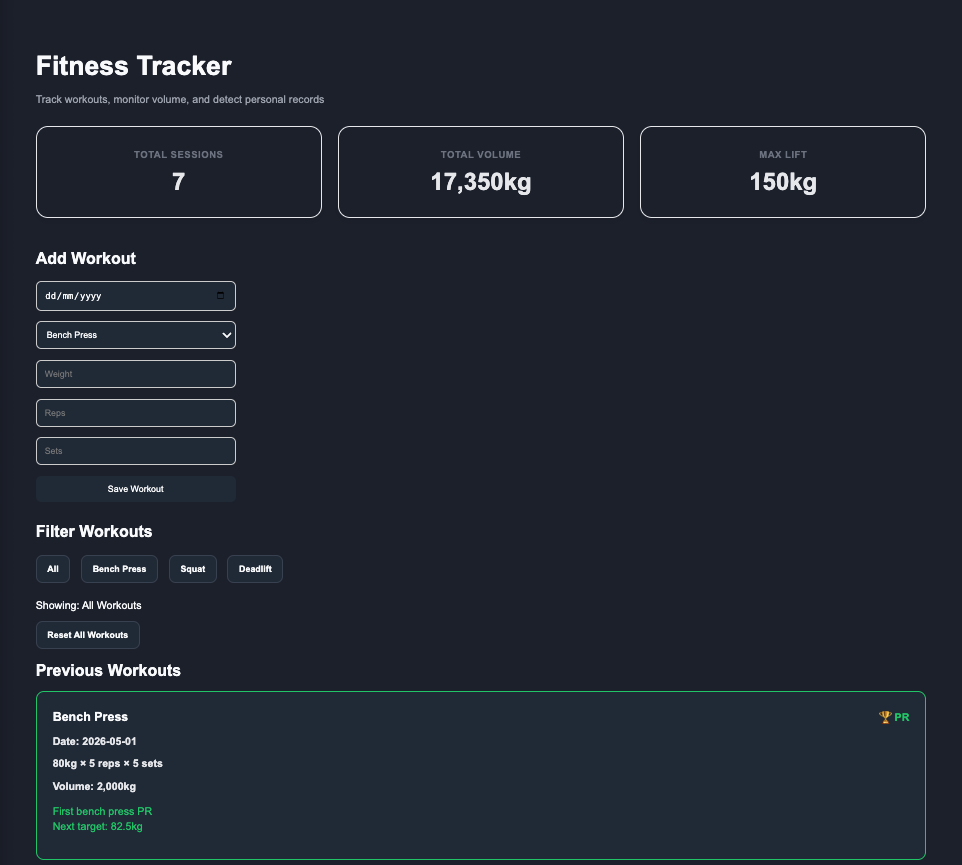
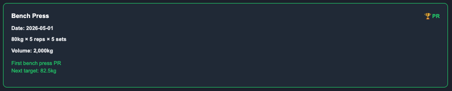
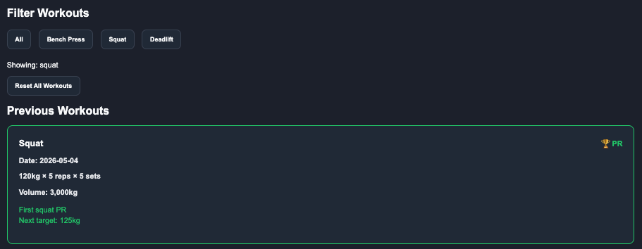

# Fitness Tracker


## Overview

Fitness Tracker is a full-stack workout tracking application built with React, Flask, and SQLite.

Users can:

- log workouts
- track training volume
- view workout history
- detect personal records (PRs)
- receive next target suggestions

The project evolved from a simple Python CLI tracker into a full-stack web application.


## Demo Flow

1. Start the Flask backend.
2. Start the React frontend.
3. Add a new workout.
4. View the workout in the history list.
5. See summary cards update automatically.
6. Add a heavier lift to trigger a PR badge.
7. Filter workouts by lift.
8. Refresh the page to confirm data persists.
9. Reset workouts if needed.


## Project Evolution

This project started as a simple Python CLI fitness tracker.

It was then expanded into:

- a SQLite-backed backend
- a Flask REST API
- a React frontend
- a full-stack workout tracking application

The goal was to build one project deeply instead of creating several shallow tutorial projects.


## Features

- Add workouts
- View workout history
- Workout filtering
- Total volume tracking
- Max lift tracking
- PR detection system
- PR improvement percentages
- Next target suggestions
- Persistent SQLite storage
- Full-stack API integration
- Reset all workouts
- Seed test data


## Tech Stack

### Frontend

- React
- Vite
- JavaScript

### Backend

- Python
- Flask
- Flask-CORS

### Database

- SQLite


## Screenshots

### Dashboard



### PR Tracking



### Workout Filters




## Setup Instructions

### Backend

```bash
cd backend
python3 -m venv ../venv
source ../venv/bin/activate
pip install -r requirements.txt
python app.py
```

Backend runs on:

```text
http://localhost:5050
```

### Frontend

```bash
cd frontend
npm install
npm run dev
```


## API Endpoints

### GET /workouts

Returns all workouts.

### POST /workouts

Adds a new workout.

### DELETE /workouts

Deletes all workouts.


## Future Improvements

- User authentication
- Exercise charts
- Deployment
- Cloud database
- Mobile responsiveness
- Workout editing


## Learning Outcomes

This project helped me learn:

- React state management
- API integration
- Flask backend development
- SQLite database usage
- Full-stack architecture
- Async JavaScript
- CRUD operations
- Project structuring


## License

MIT — see [LICENSE](LICENSE).


## Final Notes

This project was built as part of a personal software engineering learning journey.

The focus was not only on learning syntax, but also:

- architecture
- iteration
- debugging
- frontend/backend integration
- building a project deeply over multiple weeks
